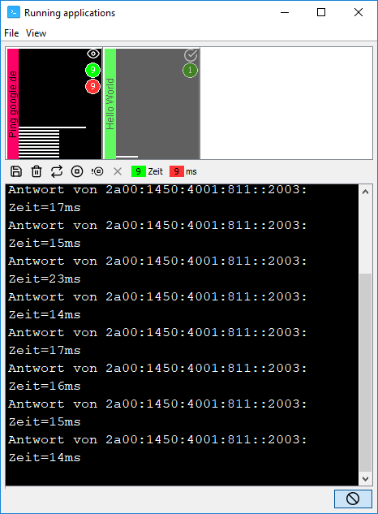
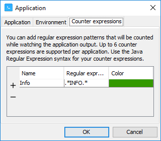
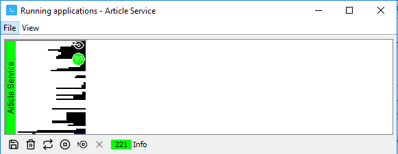

# Multi-Process Manager

# Table of Contents
1. [Long story short](#long-story-short)
2. [Features](#features)
3. [Download](#download)
4. [Screenshots](#screenshots)
5. [Launch configurations](#launch-configurations)
6. [Application](#application)
7. [Environment](#environment)
8. [Counter expressions](#counter-expressions)
9. [Variable substitutions](#variable-substitutions)
10. [How to run Gradle builds](#how-to-run-gradle-builds)

## Long story short

The Multi-Process Manager is a Java Swing application that helps managing multiple running applications. It was designed to be used by developers that need to start a lot of processes producing logs like Spring Boot applications, Tomcat-, JBoss- or any other server process.

This application manages launch configurations for you and allows starting multiple applications simultaneously. Any output of the running applications is captured and presented in a neat window providing an overview over the log file so far as well as the log file itself. The view allows to easliy navigate through the running application at any time.

## Features

The Multi-Process Manager comes with the following features:
* a new user interface making things super easy
* storing all launch configurations per user
* managing launch configurations within categories
* starting all applications within category
* starting all selected applications of a category
* stop, stop forcibly, restart applications
* save (or clear) the application output at any time
	* supports plain text
	* supports HTML
	* supports RTF
* use regular expressions (so called "counter expressions") to count matches while capturing the application output.
	* any number of counter expressions can be added
	* the first 6 counter expressios are shown in the output overview
* override environment variables in a per-application manner
* easily find your application in the overview by
	* defining a color for every launch configuration
	* defining a title for every launch configuration

## Download

You can [download the latest version of this application](https://bintray.com/schuettec/maven/download_file?file_path=com%2Fgithub%2Fschuettec%2Fmultiprocman%2Fmultiprocman%2F1.0.16%2Fmultiprocman-1.0.16-jar-with-dependencies.jar) as an executable JAR file from the Bintray repository.

## Screenshots

### The launch configuration editor

### The category editor

### The launch configuration editor

### The application manager

## Launch configurations

The launch configuration editor view enables you add all required information to run an application inside the Multi-Process Manager.

### Application

In the tab "application" you can specify an icon for this launch configuration. It is recommended to use 24x24px images for application icons. Images with other dimensions will be scaled.

__Title__: The title is a short description of this application that is displayed in the overview window.

__Command__: The command is the full command line to start the application. The command must include the full path to the application/script/batch file (except the binary programs shipped with your OS). __Use the "Find..." button to select a__

__Charset__: The charset attribute is used to capture the application output using the correct encoding. For windows command line applications the charset "IBM850" should be used. In most cases (especially Java apps) UTF-8 may be suitable.

__Working directory__: The working directory is the path to the folder within the application's process will be started. For example the Git executables may be available in `C:\Program Files\Git\bin` so this will be the path that must be set in the command. But if you want to run Git in your repository folder the working directory must be `C:\git\myRepo`.

### Environment

The environment tab lets you specify overriding variable values for the environment. Normally the started applications will inherit the environment variables from the running Multi-Process Manager. To specify another value for a variable, add the variable name in the list and specify a new value. This new value will only be visible for this application when started.

The overriding values do not affect other processes on your system.

### Counter expressions

The output of `std\out` and `std\err` of any started application is captured by the Multi-Process Manager. While the application's output is appended to the viewer the Multi-Process Manager enables you to count for matches of regular expressions.

In the above tab you can add a counter expression by specifying a name, a [Java Regular Expression](https://docs.oracle.com/javase/9/docs/api/java/util/regex/Pattern.html) and a color to easily recover the counter in the view.

The first 6 counter expressions will be displayed in the log file overview. The whole set of counter expressions will be represented by a button in the toolbar. To reset a counter expression click on the corresponding button.

The above screenshot shows the overview window with an active counter expression watching the output for the string `INFO`. The overview shows a little circle showing the current number of matches. The button in the toolbar shows the current number of matches as well as the name of this counter expression.

## Variable substitutions
When specifying the command for the launch configuration the variable substitution can be used to insert environment variable values before starting executing command:
* Check "Enable environment variable substitution"
* Use placeholders in the command string like: `${variablename}`
	* __The variable name is case-sensitive__
	* Use the "Insert variable" button to select from a list of known OS variables
	* Test the variable substitution using the button "Show substitution"
* __Note: The environment variables configured in tab "Environment" do not have an effect on the substitution.__ The substitution only uses the current environment variables seen by the running Multi-Process Manager instance.

# How to run Gradle builds

Launching Gradle builds using the Gradle wrapper needs a little more configuration than just calling the Gradle Wrapper Sh-/Batch-Script. The problem is that Gradle the script forks another JVM process. When stopping the task with the Multi-Process Manager only the script process terminates. The Gradle build will be running in background.

Here is how to setup a Gradle Wrapper launch configuration:
* Set the working directory to the Gradle project folder to work with
* Use the charset UTF-8
* Use the following command - customize the parts in `<>`
  * __Command__: `java.exe -Dorg.gradle.appname=<APP-NAME> -classpath ".\gradle\wrapper\gradle-wrapper.jar"  org.gradle.wrapper.GradleWrapperMain <TASK-AND-OTHER-COMMAND-LINE-OPTIONS>`.

